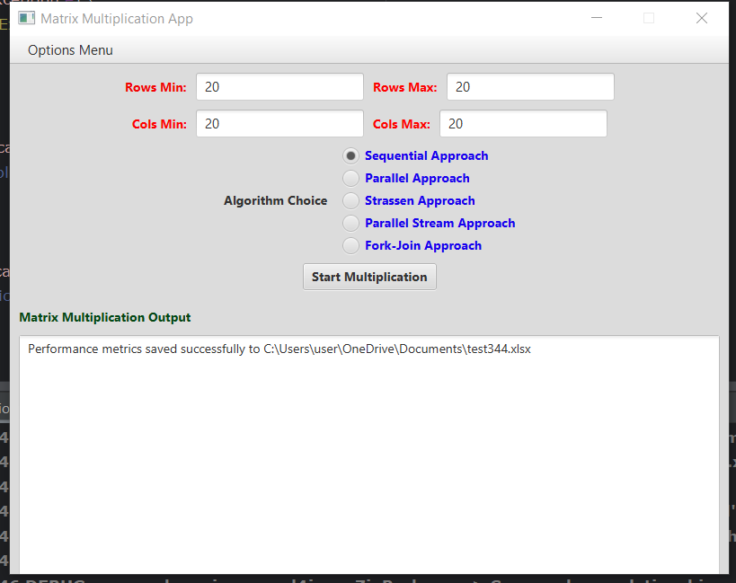

# **Matrix Multiplication App User Manual**

## **Overview**

The Matrix Multiplication App is a JavaFX-based application that performs matrix multiplication using various
approaches. It supports Sequential, Parallel, Strassen, and advanced parallelization options (Executor Service, Parallel
Stream, Fork-Join Framework). This user-friendly application is designed for both educational and practical purposes.

---

## **Features**

1. **Matrix Multiplication**: Multiply two matrices using Sequential, Parallel, Strassen, and other parallelization
   options.
2. **Dynamic Resizing**: The application layout adjusts automatically when resized.
3. **Save Options**:
    - Save the output to a `.txt` file.
    - Export performance metrics to an Excel file.
4. **Execution Time**: View the time taken for each multiplication approach.
5. **Parallelization Options**:
    - **Executor Service**: Utilizes a thread pool for parallel computation.
    - **Parallel Stream**: Uses Java 8's parallel stream for parallelization.
    - **Fork-Join Framework**: Implements the Fork-Join framework for parallel processing.

---

## **Getting Started**

### **Prerequisites**

1. **Java Development Kit (JDK)**: Ensure JDK 8 or a later version is installed on your system.
2. **JavaFX Setup**: JavaFX should be properly configured in your development environment (e.g., IntelliJ IDEA or
   Eclipse).
3. **Gradle Build Tool**: The project uses Gradle for building and dependency management.
4. **Git**: To clone the repository, you need Git installed on your system.
5. **IDE**: Use an IDE like IntelliJ IDEA or Eclipse for a seamless development experience.
6. **Excel Software**: To view the performance metrics, you need software like Microsoft Excel or LibreOffice Calc.

## **Introduction**

The **Matrix Multiplication App** is a robust application designed for educational and practical purposes to perform
matrix multiplication using three distinct methods:

1. **Sequential Approach**: Standard matrix multiplication.
2. **Parallel Approach**: Uses multiple threads to improve computation time.
3. **Strassen Approach**: An optimized algorithm based on divide-and-conquer.
4. **Parallel Stream**: Utilizes Java 8's parallel stream for parallelization.
5. **Fork-Join Framework**: Implements the Fork-Join framework for parallel processing.

This app is equipped with a user-friendly interface, dynamic resizing, and options to save the results and performance
metrics for further analysis. Whether you're a student, researcher, or developer, this app provides an intuitive way to
understand and utilize matrix multiplication techniques.


---

## **How to Run the Application**

### **Steps to Run**

1. Clone or download the project from the repository.
2. Navigate to the project directory and ensure all dependencies are correctly set up.
3. Compile the application:
   ```bash
   ./gradlew build

or use the IDE's build functionality. 4. Run the application:

From the IDE, execute the _MatrixMultiplicationApp.main()_ method.
Or use the terminal:

`java -jar build/libs/MatrixMultiplicationApp.jar`

---

## **User Interface**

### **Main Sections**

1. **Menu Bar**:
    - **Options Menu**:
        - `Exit`: Closes the application.
2. **Input Fields**:
    - **Rows Min & Max**: Specify the range for the number of rows in the matrices.
    - **Cols Min & Max**: Specify the range for the number of columns in the matrices.
3. **Algorithm Choice**:
    - `Sequential Approach`: Basic single-threaded multiplication.
    - `Parallel Approach`: Utilizes multiple threads for faster computation.
    - `Strassen Approach`: A divide-and-conquer-based optimized algorithm.
    - `Parallel Stream`: Uses Java 8's parallel stream for parallelization.
    - `Fork-Join Framework`: Implements the Fork-Join framework for parallel processing.
4. **Output Section**:
    - Displays the results of matrix multiplication.
    - Shows execution time.
    - Allows for saving the output and performance metrics.
    -




---

## **Step-by-Step Guide**

### **1. Input Matrix Dimensions**

- Enter the minimum and maximum number of rows and columns for the matrices:
    - **Rows Min & Rows Max**: The number of rows in the first matrix.
    - **Cols Min & Cols Max**: The number of columns in the first matrix and rows in the second matrix.

### **2. Choose an Algorithm**

- Select one of the three radio buttons:
    - **Sequential Approach**: For basic single-threaded multiplication.
    - **Parallel Approach**: For multithreaded computation.
    - **Strassen Approach**: For advanced divide-and-conquer multiplication.
    - **Parallel Stream**: For parallelization using Java 8's parallel stream.
    - **Fork-Join Framework**: For parallel processing using the Fork-Join framework.

### **3. Start Multiplication**

- Click the **Start Multiplication** button to initiate the computation.
- The output, including the matrices and the result, will be displayed in the **Output Section**.

### **4. Save Results**

- Navigate to the **Save Tab** for the following options:
    - **Save Output to Text File**:
        - Saves the matrix multiplication results to a `.txt` file.
    - **Save Performance Metrics to Excel**:
        - Saves the execution times and other metrics to an Excel file.

### **5. Exit the Application**

- Use the **Options Menu** > `Exit` to close the application.

---

## **Example Workflow**

1. **Input Dimensions**:
    - Rows Min: 2
    - Rows Max: 4
    - Cols Min: 2
    - Cols Max: 4

2. **Select Algorithm**: Click on `Parallel Approach`.

3. **Start Multiplication**: Click on **Start Multiplication**.

4. **View Results**:
    - Matrices and their multiplication result will appear in the output section.
    - Execution time is also displayed.

5. **Save Results**:
    - Go to the **Save Tab** and choose to save either the text output or performance metrics.

---

## **Troubleshooting**

1. **Application Doesn't Launch**:
    - Ensure you have the correct version of Java and JavaFX installed.

2. **Invalid Input Error**:
    - Enter valid integers in the input fields for matrix dimensions.

3. **File Save Errors**:
    - Ensure you have write permissions to the chosen directory.
4. **Performance Metrics Not Saved**:
    - Check if you have Excel software installed on your system.

---

## **Hardware**

- Windows 10 Pro
- 16 GB RAM
- Intel(R) Core(TM) i7-10870H CPU @ 2.20GHz
- 1 TB SSD
- NVIDIA GeForce RTX 2060
- 16 processors
- 8 cores per processor

